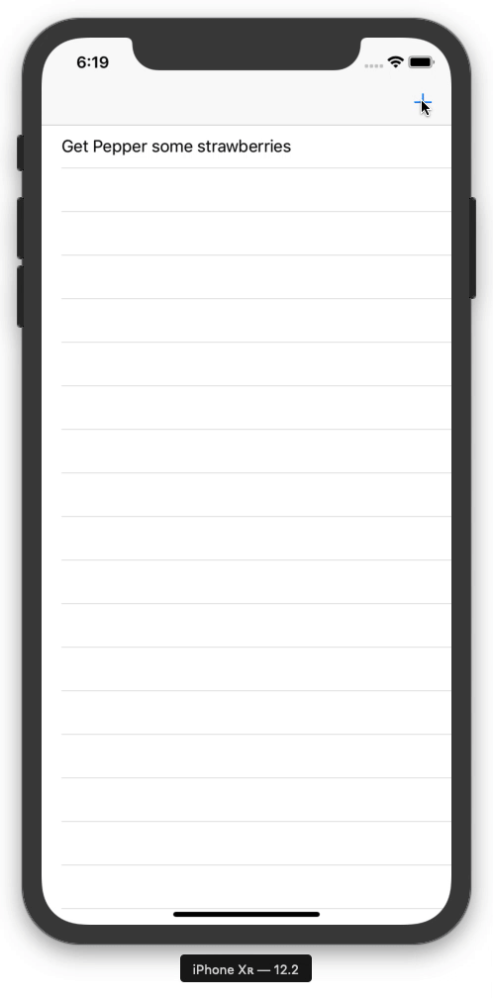

# ToDoList

## Overview

ToDoList is a to-do list app that uses Core Data! Users can add new tasks, modify existing ones, and swipe to delete! The app incorporates:

- Swift
- Core Data
- Fetched Results Controller
- Persistent Store Coordinator
- Managed Object Context

## Getting Started

> This app is not available on the App Store.

### Prerequisites

- A Mac running Xcode

### Installation

1. Clone or download the project to your local machine
2. Open the project in Xcode
3. Run the simulator

## Acknowledgements

The following resources were used in the development of this project. All custom code is my own.

- [Introduction to Core Data](https://teamtreehouse.com/library/introduction-to-core-data)

Interested in learning more about iOS Development? [Sign up today](http://referrals.trhou.se/bobbyconti1)!
